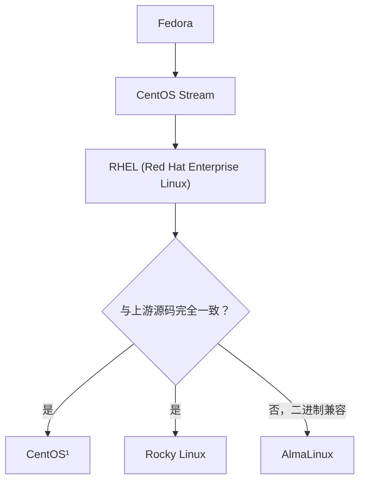

# 介绍页

为了帮助各位理解发行版的关系，我们以下图来直观表示。

```mermaid
graph TB
  A[Fedora] --> B[CentOS Stream];
  B --> C["RHEL (Red Hat Enterprise Linux)"];
  C --> D{与上游源码完全一致？};
  D -->|是| E[CentOS¹];
  D -->|是| F[Rocky Linux];
  D -->|否，二进制兼容| G[AlmaLinux];
```
[^1]: 由于红帽宣布RHEL不再免费提供源码，CentOS已停止开发。
