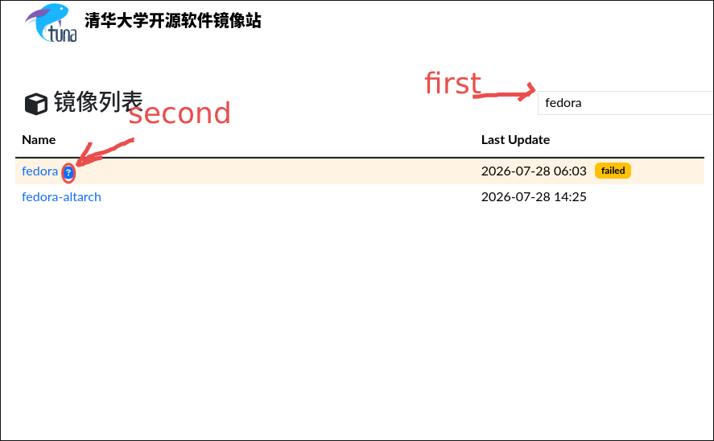
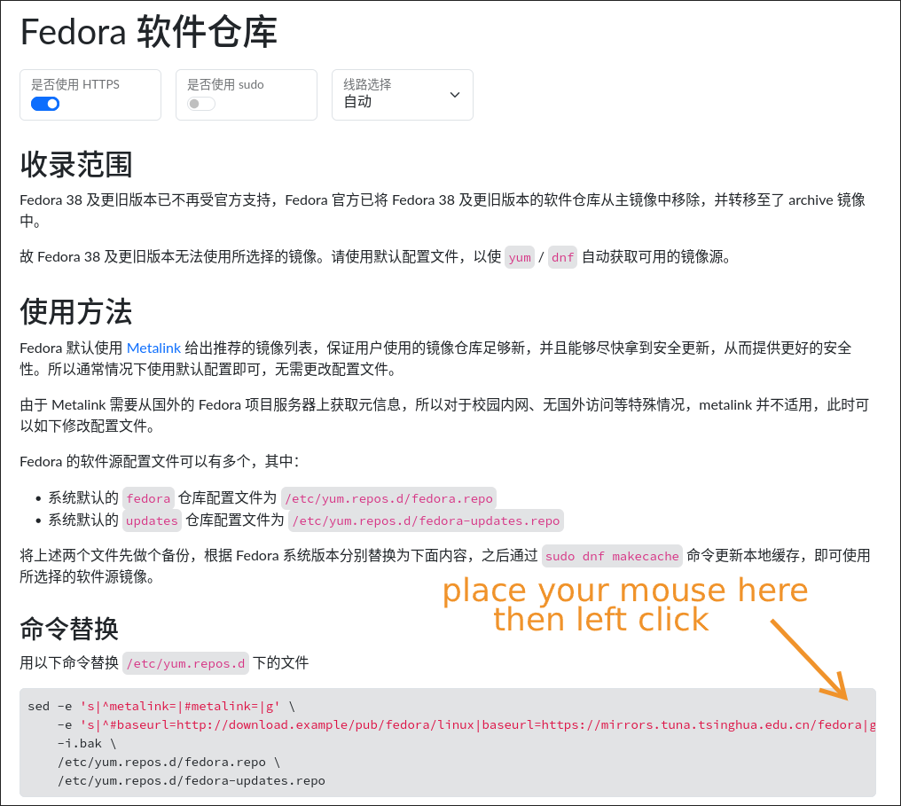
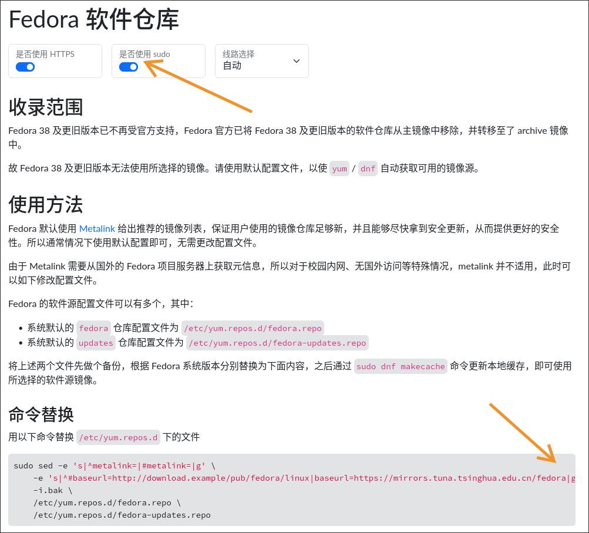

# fedora 换镜像源教程

对于新手来说，镜像源一直都是一个绕不开的话题，因为没有人教我们:

- 什么是镜像源 ?
- 为什么要换源 ?
- 别人给我一个镜像站网址， 我怎么换源 ?

所以接下来我希望简单谈谈我的理解，并教大家如何配置fedora的国内镜像源

---

## 什么是镜像源

Linux 的软件管理依托于**包管理器**(package manager)。
当你使用 `apt`, `dnf`, `pacman` 之类的包管理器下载软件的时候，就是包管理器向存储核心软件包的服务器发送请求,之后将所需的软件包返回给你(也就是客户端)
所以过程就是， 你 敲下 `sudo apt install htop -y` 之后， 包管理器向服务器发送请求要 htop 的 deb 包。然后包管理器拿到包之后进行安装软件.

而一般而言，每一个发行版都有自己的软件包服务器，这些官方服务器的软件是经过测试人员测试然后放到仓库当中供使用者下载。
但是，几乎所有的官方服务器，都在国外(我不知道有没有国内的， 但是印象中应该没有).
这个时候由于某些原因，**很多地方都无法正常通过官方服务器下载软件。**
这个时候就有人提议将这些软件仓库复制到各个地区的服务器，来解决下载不顺利的问题。

也就是说，**镜像源就是一些定期同步复制官方源的，用于解决下载问题的软件源**

---

## 为什么要换源

最大的原因就是网络问题，因为我们有国家级别的防火墙。
导致我们连接国外服务器要么超时，要么速度像乌龟在爬

所以**选用可靠的国内镜像源是必须的**(如果你没有魔法的话)

---

## 怎么换

这里举fedora的例子，我们使用 [TUNA](https://mirrors.tuna.tsinghua.edu.cn/) (也就是清华维护的镜像站)

- **访问镜像站**
  首先打开镜像站, 也就是访问 => <https://mirrors.tuna.tsinghua.edu.cn/>

- **搜索发行版**
  这个时候我们在搜索框里面输入 fedora

然后就会出现筛选结果， 这个时候我们不要直接点fedora, 而是点旁边的那个 `?` (也就是tuna给的换源官方手册)



- **命令替换**

之后我们直接复制命令替换的那个内容



注意我们这里复制的是使用 root 进行操作的指令
如果直接用，大概率会有 Permission denied 的报错

这个时候我们别慌, 在前面先加上一个 `sudo` (记得是 sudo 然后空一个再粘贴命令)就可以了， 当然tuna也考虑到了这一点， 所以你直接打开上面的 是否使用sudo的开关然后再复制也可以

- 预先打勾sudo(**如果你使用上面的方法手动加了跳过这个步骤**)
  

> 顺便说一下, sudo 的意思是 super user do, 就是用超级管理员执行这个命令

替换完成之后， 我们可以直接进行系统的**软件更新，见证魔法** => 我刚开始用的时候，也感觉直接更新所有软件是一个很酷的事情

```bash
sudo dnf update # 检查并更新
```

ok恭喜你学会了如何换源，同样的方法可以用在其他的发行版上，也是搜发行版的名字然后点问号进去换
